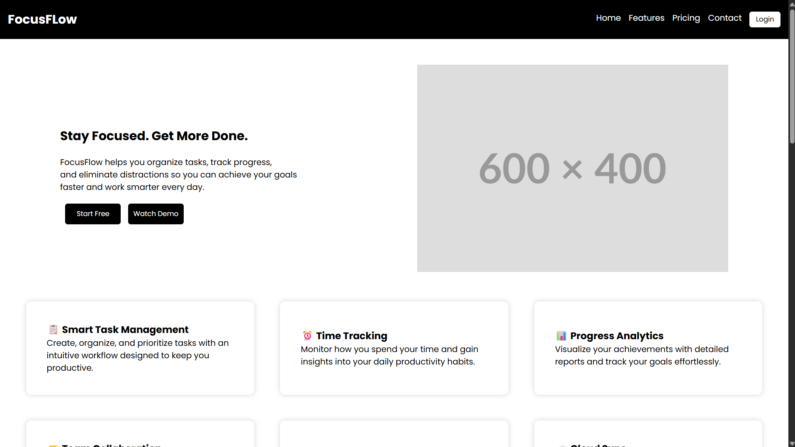

# FocusFlow

A fictional productivity platform landing page built with HTML and CSS.

## Preview

## Features

- Hero section
- Feature cards
- Pricing plans
- Testimonials
- Newsletter section
- Hover effects

## Technologies

- HTML5
- CSS3

## How to Run

1. Clone the repository.
2. Open the project folder.
3. Open `index.html` in your browser.
